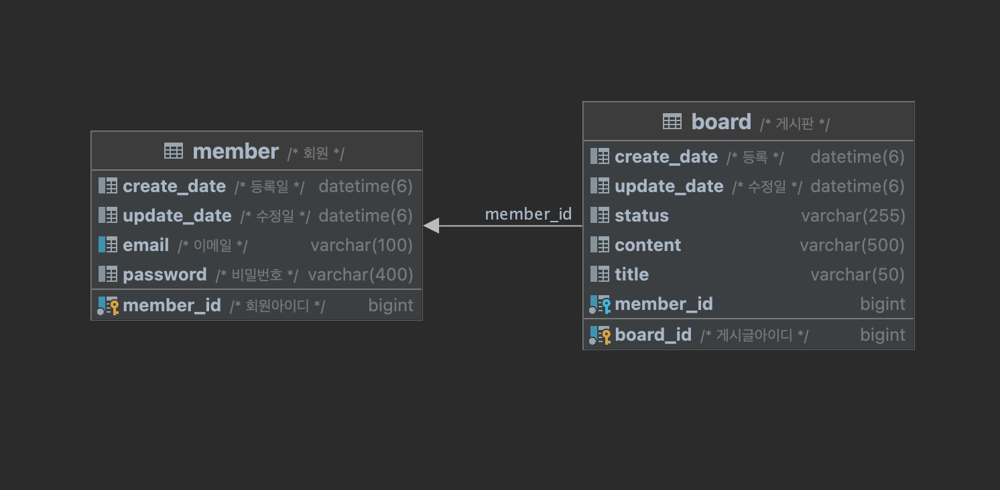

# wanted-pre-onboarding-backend

---

* ### 지원자 성명 : 이건목


---

* ## 애플리케이션의 실행 방법 (엔드포인트 호출 방법 포함)


  1. ### 로컬 저장소 다운로드 링크에서 mysql 8버전 다운로드
    
     https://downloads.mysql.com/archives/installer/

     - mysql 실행 및 데이터베이스, 유저 셋팅
     ```mysql
        # MYSQL 접속
        mysql -u root -p
     
        # DATABASE 생성
        CREATE DATABASE task;

        # 유저생성
        CREATE USER 'task'@'localhost' IDNETIFIED BY 'task';
        
        # 권한부여
        GRANT ALL PRIVILEGES ON task.* TO 'task'@'%';
  
        # 변경사항 저장
        FLUSH PRIVILEGES;
     ```
  
  2. ### git 저장소 복제
     
     ```git
     git clone https://github.com/LGM1995/wanted-pre-onboarding-backend.git
     ```

  3. ### 프로젝트 빌드

      ```shell
      /* windows */
      $ gradlew build
    
      /* linux */
      $ ./gradlew build
      ```
  
  4. ### 프로젝트 실행

      ```shell
      java -jar task-0.1.jar
      ```

---
* ## 데이터베이스 테이블 구조



---

* ## 구현한 API의 동작을 촬영한 데모 영상 링크

[![Video Lable]](http://img.youtube.com/vi/DlVX_lk0Wr0/0.jpg)](https://youtu.be/watch?v=DlVX_lk0Wr0)

---

* ## 구현 방법 및 이유에 대한 간략한 설명

### Error: TaskException을 예상되는 에러에 대해 준비된 에러메시지 출력


### 과제 1. 사용자 회원가입 엔드포인트

유효성 검사에 대해 커스텀 어노테이션을 생성

@MailCheck : null, 빈문자를 허용하지 않으며 @의 포함여부를 확인

@PasswordCheck : null, 빈문자를 허용하지 않으며 매직넘버가 아닌 상수 MIN(8) 값을 사용하여 최소 8자 이상의 문자를 받음

초기에는 @NotBlank @Email @Pattern @Length 등의 어노테이션을 활용 하였으나 과제의 출제 의도가 유효성 검사에 있어 사고를 하는 것을 요구하는 것으로 판단하여 커스텀 어노테이션을 만들어 진행

### 과제 2. 사용자 로그인 엔드포인트

회원가입과 마찬가지로 Member Request에 대한 커스텀 어노테이션으로 유효성 검사

로그인과 회원가입에 필요한 필드 값이 같더라도 Request 객체를 분리하여 생성

Login에 성공하면 서버는 클라이언트에게 JWT 토큰 발급

토큰의 키와 만료 시간은 application.yml에서 관리하며 따로 RefreshToken은 발급하지 않음.

요구사항에 없는 refresh token과 권한은 따로 생성하지 않음

### 과제 3. 새로운 게시글을 생성하는 엔드포인트

게시글 생성을 위해 Request Body에 title과 content를 담아 요청

헤더에는 발급받은 토큰이 있어야함 Authorization : accessToken 

컨트롤러에서 @AuthenticationPrincipal 어노테이션을 활용하여 회원아이디를 전달

회원이 실제 디비에 있는 회원이라면 게시물에 회원을 담아 등록 (토큰 변조 대비)

유효성 조건은 따로 요구사항에 없어 null과 빈 값에 대한 유효성 처리를 하는 공통의 CommenCheck를 만들어서 사용

게시글의 상태값은 Enum으로 관리 [POSTING(게시), BEN(정지), DELETE(삭제)]

### 과제 4. 게시글 목록을 조회하는 엔드포인트

JPA Pageable을 사용하여 페이징 처리

 - page : 요청할 페이지 번호
 - size : 한 페이지 당 조회 할 갯수 (default : 20)
 - sort : Sorting에 대한 값 설정하는 파라미터로, 기본적으로 오름차순이다. 표기는 정렬한 필드명,정렬기준 ex) createdDate,desc
를 사용하여 페이징 호출 가능

그 외에도 Page에 대한 Request와 Response를 따로 커스텀 하지 않았기에 JPA에서 제공하는 Page 옵션 사용가능

### 과제 5. 특정 게시글을 조회하는 엔드포인트

@PathVariable을 사용하여 게시글 아이디를 통한 상세조회

만약 존재하지 않은 아이디라면 미리 정의된 TaskException에 의해 ErrorCodeMessage 출력

### 과제 6. 특정 게시글을 수정하는 엔드포인트

@PathVariable을 사용하여 게시글 아이디를 받고 Request에 title과 content를 담아 게시글을 수정

컨트롤러에서 @AuthenticationPrincipal 어노테이션을 사용하여 인자값으로 회원의 email 전달

회원이 실제 디비에 존재하는지 확인 후 실제 게시글의 회원과 같은지 검증 (토큰이 탈취 됐을 때를 대비)

기본적으로 content와 title에 대한 유효성 검사를 한번 하고 마지막 Entity에서 값이 있는 경우에 대해 title과 content값을 치환함

### 과제 7. 특정 게시글을 삭제하는 엔드포인트

@PathVariable을 사용하여 게시글 아이디를 받음

컨트롤러에서 @AuthenticationPrincipal 어노테이션을 사용하여 인자값으로 회원의 email 전달

회원이 실제 디비에 존재하는지 확인 후 실제 게시글의 회원과 같은지 검증 (토큰이 탈취 됐을 때를 대비)

문제가 없으면 게시글의 상태값을 삭제 상태로 변경

---

* ## API 명세(request/response 포함)


| 설명         | method | url              | request                                             | response                                                                                                                                                                                                                                                                                                                                                                                          |
|------------|----|------------------|-----------------------------------------------------|---------------------------------------------------------------------------------------------------------------------------------------------------------------------------------------------------------------------------------------------------------------------------------------------------------------------------------------------------------------------------------------------------|
| 회원가입       | post | /auth/signup     | email: String, password: String                     | { id: long, email: String }                                                                                                                                                                                                                                                                                                                                                                       |
| 로그인        | post | /auth/login      | email: String, password: String                     | { accessToken : String }                                                                                                                                                                                                                                                                                                                                                                          |
| 게시글 등록     | post | /board           | title: String, content: String                      | { id: long, title: String, content: String, status: String, writer: String, createDate: LocalDateTime, updateDate: LocalDateTime }                                                                                                                                                                                                                                                                |
| 게시글 조회     | get | /board/list      | page: int ,size: int , sort: int                    | { <br>content: [ { id: long, title: String, content: String, status: String, writer: String, createDate: LocalDateTime, updateDate: LocalDateTime } ] },</br> { pageable: String, totalPages: int, totalElements: int, last: boolean, numberOfElements: int, size: int, number: int, first: boolean,<br> sort: { unsorted: boolean, sorted: boolean, empty: boolean },<br> empty: boolean }<br> } |
| 게시글 상세     | get    | /board/{boardId} | boardId: int (path)                                 | { id: long, title: String, content: String, status: String, writer: String, createDate: LocalDateTime, updateDate: LocalDateTime }                                                                                                                                                                                                                                                                |
| 게시글 수정     | put    | /board/{boardId} | boardId: int (path), title: String, content: String | { id: long, title: String, content: String, status: String, writer: String, createDate: LocalDateTime, updateDate: LocalDateTime }                                                                                                                                                                                                                                                                |
| 게시글 삭제     | delete | /board/{boardId} | boardId: int (path)                                 | { id: long, title: String, content: String, status: String, writer: String, createDate: LocalDateTime, updateDate: LocalDateTime }                                                                                                                                                                                                                                                                |

> response에 대해 상태값이 아닌 Response 객체를 리턴 시킨 이유는 데이터를 확인하기 위함일 뿐 다른 의도는 없다.

---

## TODO TASK

- Refresh Token 을 따로 구현하진 않았으나 하게 된다면 디비에서 관리할 토큰을 생성, 만료시간을 다르게 하여 Refresh Token으로 만료된 토큰에 대해서는 재발급 진행

- model을 Domain으로 변경하여 추상화된 관점에서 에플리케이션의 특정 기술에 대한 종속성과 결합도를 줄이고 infrastructer에서 구현을 재정의(현재는 Entity 모델에 의한 JPA에 종속된 코드)

- 깃에서 브랜치 관리를 통해 소스 통합 도커를 활용하여 이미지 파일을 도커 허브에 등록하여 EC2에서 도커 컨테이너를 띄워 애플리케이션 구동(직장인으로써 시간이 부족하여 현재는 로컬에서만 작동하는 소스, git도 커밋 메시지 전략은 사용하였으나 혼자하는 프로젝트라 main에 직접 커밋함...)

- RestDocs를 활용한 테스트 코드 작성 및 API 문서 자동화(현재 프로젝트에 간단하게 테스트를 해보긴 하였으나 시간이 없어 완성하지 못함, 현재는 서비스에 대한 테스트 코드밖에 없다.)

> 부족한 점과 해야할 일을 확실하게 알게 된 TASK... 시간 투자를 조금 더 할 수 있다면 개선할 점이 많았을 것....